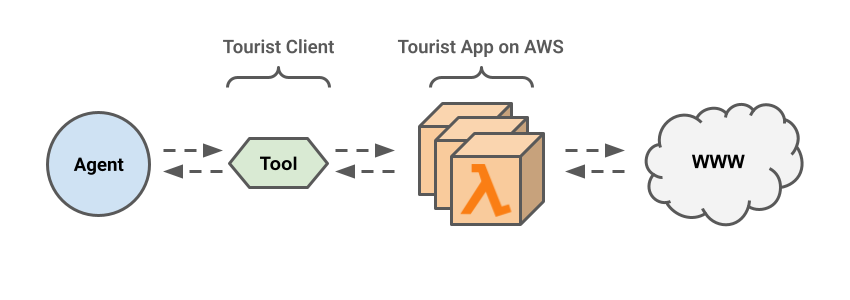

# Tourist🤳

[](https://badge.fury.io/py/tourist)

An open-source, low-cost, serverless application for SERP extraction and web scraping. 

Work on LLM projects without worrying about credits, subscriptions, or rate-limits. Tourist is a free alternative to many mainstream SERP API services. Run Tourist on your machine or deploy it into your own AWS account.  

> [!IMPORTANT]  
> Tourist is in early development. Features and API's may change unexpectedly.

## Overview


Tourist has both Service and Client components. The Service (HTTP API) handles requests from the Client (your app, agent, or scraper scripts). You're in control of both components! None of your data is ever processed or stored by third parties.

## Service

### Local deployment (for testing...)

> [!TIP]  
> Docker is recommended for running Tourist locally to handle dependencies for headless browsing.

1. `docker run -e X_API_KEY="whatever" -p 8000:8000 ghcr.io/pogzyb/tourist:latest`

If the service came up correctly, you should see:
```
INFO:     Started server process [1]
INFO:     Waiting for application startup.
INFO:     Application startup complete.
INFO:     Uvicorn running on http://0.0.0.0:8000 (Press CTRL+C to quit)
```

Check the docs at `http://localhost:8000/docs`

### AWS deployment (for real...)

Prerequisites:
1. AWS Account and Credentials
2. S3 Bucket for storing an OpenTofu statefile
3. Docker Daemon

Read about the deployment container in the [deploy/](./deploy/DEPLOY.md) folder.

Example deployment command:

```
docker run \
    -v /var/run/docker.sock:/var/run/docker.sock \
    --env-file .env \
    ghcr.io/pogzyb/tourist-deploy:latest \
    apply \
    -b tourist-statefile \
    -k SeCretTK3y
```

Use your endpoint: `https://xxxxxxxx.lambda-url.us-east-1.on.aws` (available the deployment outputs)

> [!WARNING]  
> Tourist uses serverless infrastructure to keep costs extremely low; however these costs will not be $0.00 depending on how heavily you use your API.

> [!IMPORTANT]  
> Tourist uses the X-API-KEY authorization header to protect your API, you should set this value when deploying.

## Client

Build your own LLM tools, web scraping apps, or automated testing workflows with the Tourist client.

#### Python

You can use the python client to interact with your Tourist service.
Check out the [examples](https://github.com/pogzyb/tourist/tree/main/examples) folder for the complete code.

```
pip install tourist
```

##### LLM Tools
For example, create a LangChain Tool for your LLM Agent.

```
from tourist.core import TouristScraper
from langchain_core.tools import tool

# Assumes you're running locally,
# change this to your cloud endpoint if you've deployed via terraform.
scraper = TouristScraper(
    "http://localhost:8000",
    x_api_key="doesntmatterlocally",  # authorization secret  
)


@tool
def search_tool(query: str) -> str:
    """
    A search tool.
    Useful for when you need to answer questions about current events, people, places, or things.
    Input should be a search query.
    """
    return scraper.get_serp(query, max_results=3):


# ... use the tools

```
