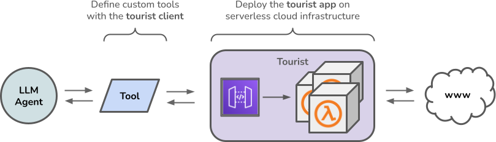

# Tourist🤳

[](https://badge.fury.io/py/tourist)

An open-source, low-cost, serverless application for web scraping. 


> [!WARNING]  
> Tourist is still in early development. Features and API's may change unexpectedly.



### Service

#### Local (for testing.)

Run the Tourist service on your local machine for testing or prototyping:

0. Have docker
1. Clone this repo
2. `make tourist-local` - runs a docker container on your machine

Check the docs at `http://localhost:8000/docs`

#### AWS (for real.)

Deploy your own instance of Tourist into AWS with Terraform.

<b>IMPORTANT: Tourist uses serverless infrastructure to keep costs extremely low, however the costs will not be $0.</b>

1. Have docker
2. Have an AWS account with credentials copied to `.env.aws` in the root of this project
3. Clone this repo
4. `make tourist-iac-interactive`
5. `terraform apply` - deploys the infratructure into your AWS account

Use your endpoint: `https://<uuid>.execute-api.us-east-1.amazonaws.com/main` (available in terraform outputs)

### Client

Build your own LLM tools, web scraping apps, or automated testing frameworks with Tourist.

#### Python

You can use the python client to interact with your Tourist service.
Check out the [examples](https://github.com/pogzyb/tourist/tree/main/examples) folder for the complete code.

```
pip install tourist
```

##### LLM Tools
For example, create a LangChain Tool for your LLM Agent.

```
from bs4 import BeautifulSoup as bs
from tourist.core import TouristScraper
from langchain_core.tools import tool


scraper = TouristScraper(
    "http://localhost:8000", 
    "no-secret", 
    concurreny=1,
)


@tool
def scrape_tool(url: str) -> str:
    """
    A web scraper. 
    Useful for when you need to answer questions related the contents of a website or URL.
    Input should be a URL.
    """
    results = scraper.get_page(url)
    if source_html := results.get("source_html"):
        soup = bs(source_html, "html.parser")
        return soup.get_text()
    else:
        return "Could not scrape that page. Try again."


@tool
def search_tool(query: str) -> str:
    """
    A search tool.
    Useful for when you need to answer questions about current events, people, places, or things.
    Input should be a search query.
    """
    results = scraper.get_serp(query, max_results=3):
    return " ".join([r["content"] for r in results])


# ... use the tools

```
##### Selenium 

You can submit selenium scripts (human or AI-generated) to Tourist for execution.

```
from pprint import pprint

from tourist.core import TouristScraper


scraper = TouristScraper("http://localhost:8000", "no-secret")

my_selenium_code = """
# `driver`, a selenium `webdriver.Chrome` object, is available in globals
driver.get("https://www.example.com")
html = driver.page_source
# any key:values stored in `actions_output` will be available in the response
actions_output["html"] = html
actions_output["current_url"] = driver.current_url
"""

result = scraper.get_page_with_actions(my_selenium_code)
assert result["current_url"] == "https://www.example.com/"
pprint(result["html"])

```
### Contributions

This is an open-source project. Please consider adding improvements or features related to your specific use-case. Chances are someone else is also facing the issue or limitation. Some ready-to-do tasks can be found in the source code as `TODO/Contribution: ...`.

### Credits

Components of this repository were influenced by these projects! Check them out.

- [awslabs/aws-lambda-web-adapter](https://github.com/awslabs/aws-lambda-web-adapter)
- [umihico/docker-selenium-lambda](https://github.com/umihico/docker-selenium-lambda)